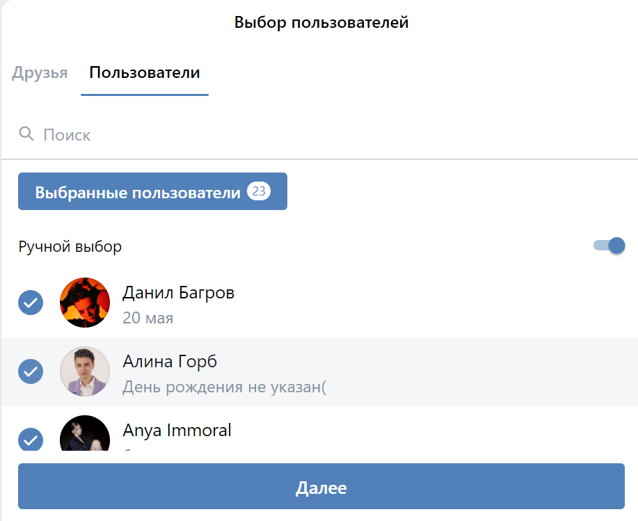

# VK mini apps birthday calendar generator app

React app within VK ecosystem in an embedded app format for mobile and desktop version of the main website. 

## Main features:

1. Searching and selecting friends and users to be included in the calendar with pagination support
2. Updating selection and providing missing birthday info
3. Server-side calendar generation

## Technologies used: 

1. React
2. MobX
3. VK toolkit: VKUI, VKBridge
4. Express

### Deploy: 

Deployed with Netlify, available at [VK](https://vk.com/app51426746) (registration needed)
